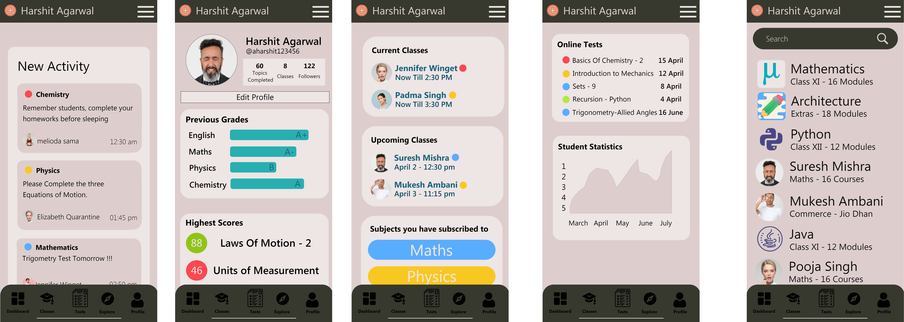
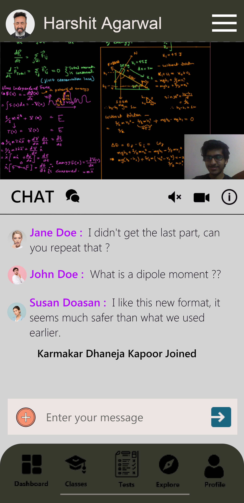

# Shotes

**One App for all Academics**

**WebRTC UI**

<table style="border-collapse:collapse;" cellspacing="0" cellpadding="0">
  <tr>
    <td></td>
    <td></td>
  </tr>
   <tr>
    <td align="center">Landscape</td>
     <td align="center">Portrait</td>
  </tr>
 </table>

***
## Newer researches to be possibly implemented

### Security (Cryptography)

#### Ciphers
   **CHACHA20-POLY1305** : https://tools.ietf.org/pdf/rfc7539.pdf
   
   **AES/GCM (will not use as it requires hardware acceleration which is not worth compromising the user-experience)** : https://luca-giuzzi.unibs.it/corsi/Support/papers-cryptography/gcm-spec.pdf
   
  **AES/CBC** : https://csrc.nist.gov/csrc/media/projects/cryptographic-standards-and-guidelines/documents/aes-development/rijndael-ammended.pdf
   
#### Key exchange group
   **ECDHE Technology for Public/Shared Key Encryption**: Couldn't find the paper i read it in.
   
   **X25519 Curve**: https://www.youtube.com/watch?v=_zYQklWcowU
   
   **RSA Implementation to avoid third-party intrusion**: [RSA New Paper](https://d1wqtxts1xzle7.cloudfront.net/52104438/20130702.pdf?1489165174=&response-content-disposition=inline%3B+filename%3DData_Encryption_and_Decryption_Using_RSA.pdf&Expires=1599884902&Signature=ObtjDBPi5qoQL8T7hLgS84GeXqDp0lCSf-EzoKWuKAjqbIytylK4tX2cR0WZsMJNSMVr3OkrLAsEwyLo6rHCkDEdHaKzJIPMV7mHIPJgRQ7OF63lXySBRRMXzwfyWp2yjlvjPN4sri7010Otgl2cJEhqpUBM7gzDM5yXvMW7ftYz8CjlG31XCo6jGbsdbLdaSddcXXzm~fIvgmUL9-Bm5V84aI4LAn-V5ani0-9kdgXTPCy0qNuTt1JNkuSn88hG4zRAMJe9PfnnFa8FEN1HYhUundi1k1bkVSU5PDSrSDERn5pamzg8yTK3zX~LLy6WFYc~slIM0dkTrHqrEvsUjw__&Key-Pair-Id=APKAJLOHF5GGSLRBV4ZA)
 [RSA Old Paper](https://pdfdirectory.com/sample/sample-0702-the-rsa-algorithm.pdf)
 
 **Choices**: ECDHE RSA with CHACHA20-POLY1305 or ECDHE RSA with AES/CBC

## Installing
 
 Not Released Till Now
 

## Contributing

Please read the 
[Bugs And Todo List](BugsAndTodo.md) file for details on contributing

For a summary of feature lists, click [here](Otherfeatureplans.md).

Also Checkout The UI Designs From
[UI Designs](UIDesign/) .

